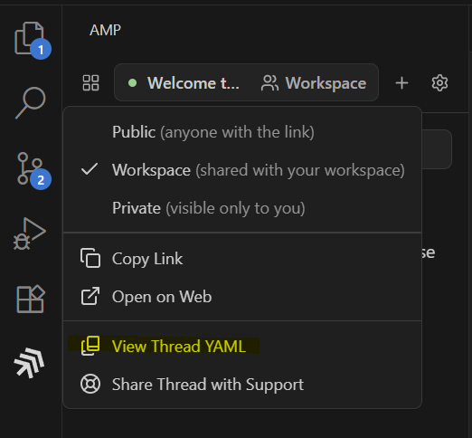

# How to obtain the system prompt for [Amp](https://ampcode.com)
# 如何获取 [Amp](https://ampcode.com) 的系统提示

1. Login with Amp using VScode
1. 使用 VScode登录 Amp
2. Issue a short query into Amp
2. 在 Amp 中发出一个简短的查询
3. Hold down Alt (windows) or Option (macOS) and click on the workspace button
3. 按住 Alt (windows) 或 Option (macOS) 并点击工作区按钮



4. Click view Thread YAML
4. 点击查看线程 YAML

# Notes
# 注意

The system prompt used by Amp is tuned to Sonnet 4.x and has other LLMs registered into it as tools ("the oracle"). To obtain the `GPT-5` tuned system prompt then you need to configure VSCode user settings with the following and then follow the steps above again
Amp 使用的系统提示针对 Sonnet 4.x 进行了调整，并将其他 LLMs 注册为工具（“预言机”）。要获取 `GPT-5` 调整的系统提示，你需要使用以下内容配置 VSCode 用户设置，然后再次按照上述步骤操作

```json
{
    "amp.url": "https://ampcode.com/",
    "amp.gpt5": true
}
```
